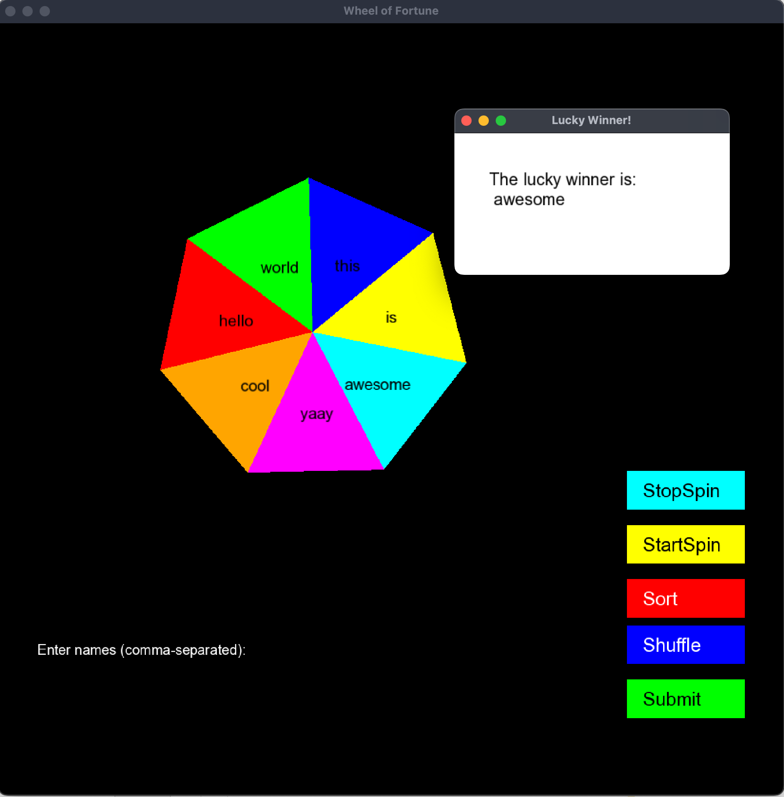

# challenge-wheel

#### Problem Statement:  
Challenge Wheel Coding Challenge: https://codingchallenges.fyi/challenges/challenge-wheel

#### Steps to Build the Application 

```shell
$ git clone git@github.com:hariharanragothaman/challenge-wheel.git
$ cd challenge-wheel
$ mkdir build 
$ cd build 
$ cmake .. 
$ make 
$ cp -r ../ui/*.* . 
$ ./wheel 
```


#### Output

